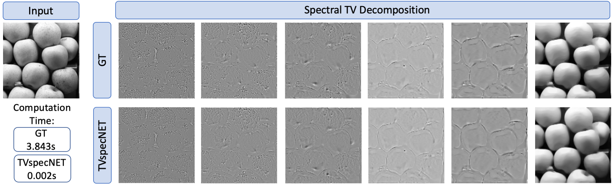

# Deeply Learned Spectral Total Variation Decomposition

This repository is the official implementation of [Deeply Learned Spectral Total Variation Decomposition](https://arxiv.org/abs/2006.10004) by Tamara G. Grossmann, Yury Korolev, Guy Gilboa and Carola-Bibiane Schönlieb. 

Computing non-linear spectral decompositions of images with model-driven approaches is cumbersome and computationally intensive as it amounts to solving multiple non-smooth optimisation problems. Instead, we propose a neural network approximation, TVspecNET, of the spectral total variation decomposition that achieves a speed up of more than 3 orders of magnitute and retains the main properties of the TV transform. 


*Visual comparison of the TVspecNET decomposition and the ground truth (GT) on an example image from MS COCO [[1]](#1).*

If you use this code, please cite:
```bibtex
@article{grossmann2020,
    title={Deeply Learned Spectral Total Variation Decomposition},
    author={Tamara G. Grossmann and Yury Korolev and Guy Gilboa and Carola-Bibiane Schönlieb},
    year={2020},
    eprint={2006.10004},
    archivePrefix={arXiv},
    primaryClass={cs.CV}
  }
```

## Requirements

The code was written in Pytorch version 1.1.0 for CUDA 9.0. Following packages are required to smoothly run the code:
- pytorch
- numpy
- tensorboardX 
- torchvision
- scipy
- scikit-image

To install all package requirements directly into the conda environment TVspecNET, execute:

```setup
conda env create --file TVspecNET.yml
conda activate TVspecNET
```

A dataset for training or testing the network is not provided in this repository, but can be easily generated from e.g. MS COCO [[1]](#1) using the model-driven approach by Gilboa [[2](#2),[3](#3)] ([code](https://guygilboa.net.technion.ac.il/2020/10/09/spectral-total-variation-color/)). Our code takes .mat files as the input, since the model-driven code is written in Matlab.

## Training

To train the TVspecNET in the paper, run this command:

```train
python training_TVspecNET.py --train_data <path_to_training_data> --test_data <path_to_testing_data> --cuda_card 0 --model 'TVspecNET' --model_id <ID_for_training_model> --summary_dir <path_to_tensorboardX_summary> --epoch 5000 --batch_size 8
```
The training code is written for .mat data type images and the default model is TVspecNET with a normalised MSE loss. However, we also include the possibility to train the F-TVspecNET and U-TVspecNET by changing the parser argument --model to either 'FTVspecNET' or 'UTVspecNET'. Additionally, we have included code for adding different loss functionals (i.e. normalised MSE of the image gradients and the MSE between the input image and the sum over all output images). Please uncomment the corresponding lines to access these loss functionals.

The code was partially taken from [Kai Zhang](https://github.com/cszn/DnCNN) and includes parts from [Naoto Usuyama](https://github.com/usuyama/pytorch-unet/) for the U-TVspecNET architecture and from [Kai Zhang](https://github.com/cszn/KAIR) for the F-TVspecNET architecture.

## Evaluation

To evaluate the TVspecNET on your own data, run:

```eval
python main_test_TVspecNET.py --set_dir <path_to_testing_data> --model_dir 'models/TVspecNET/' --model_name 'model.pth' --result_dir 'results/' --save_result 0 --save_images 0 --model 'TVspecNET' --cuda_card 0
```
The code to test the TVspecNET model is written for .mat data type images. If the groundtruth exists, it will automatically evaluate the TV transform properties (one-homogeneity, translation and rotation invariance). We include 2 data processing modes for the groundtruth:
a) image was decomposed into 50 bands and will be dyadically combined here
b) image was decomposed into 6 dyadic bands

We additionally enable testing of F-TVspecNET (choose --model 'F-TVspecNET') and U-TVspecNET (choose --model 'U-TVspecNET').

## Pre-trained Models

You can find the pretrained model for TVspecNET (trained on a subset of MS COCO [[1]](#1) according to the default settings of the training code provided) in [/models/TVspecNET](https://github.com/TamaraGrossmann/TVspecNET/tree/main/models/TVspecNET/).

## Results

Our model achieves the following performance on a subset of MS COCO [[1]](#1):

| Model name         | SSIM  | PSNR | sLMSE |
| ------------------ |---------------- | -------------- | -------------- |
| TVspecNET  |     0.9600         |      30.867       |      0.829    |
| F-TVspecNET  |     0.9377         |      28.098       |      0.6854    |
| U-TVspecNET  |     0.9233         |      28.993       |      0.7382    |


## References
<a id="1">[1]</a> 
T.-Y. Lin, M. Maire, S. Belongie, L. Bourdev, R. Girshick, J. Hays, P. Perona, D. Ramanan, C. L. Zitnick, and P. Dollár. 
Microsoft COCO: Common Objects in Context. 
arXiv preprint arXiv:1405.0312v3, 2014.

<a id="2">[2]</a> 
G. Gilboa. A spectral approach to total variation. In A. Kuijper, K. Bredies, T. Pock, and H. Bischof, editors, Scale Space and Variational Methods in Computer Vision, pages 36–47, Berlin, Heidelberg, 2013. Springer Berlin Heidelberg.

<a id="3">[3]</a> 
G. Gilboa. A total variation spectral framework for scale and texture analysis. SIAM Journal on Imaging Sciences, 7(4):1937–1961, jan 2014.
